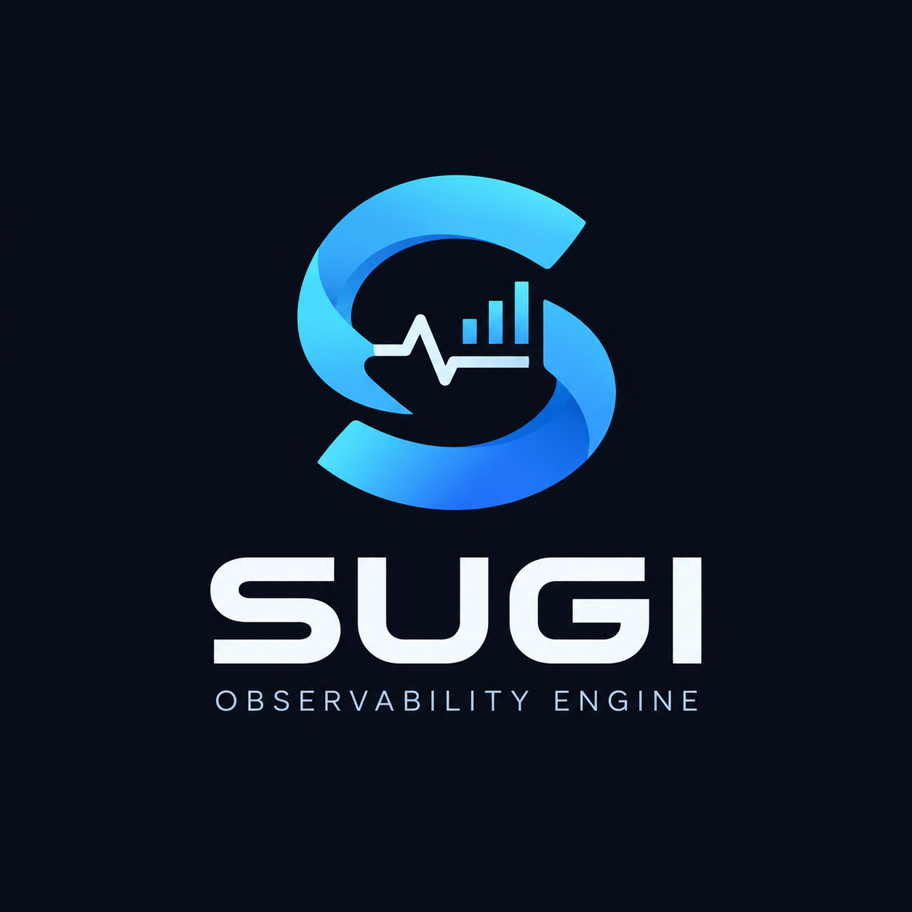

<p align="center">
  
</p>

# Sugi

<p align="center">
  <strong>A zero-dependency, ultra-lightweight single-binary observability engine in pure Go.</strong><br>
  Real-time Linux metrics & structured log aggregator with embedded dark-mode dashboard.
</p>

<p align="center">
  
  
  
  
  
  
</p>

---

## Philosophy & Core Strengths

1. **Single Binary Executable (`./sugi`)**:
   Backend engine, persistent embedded database, and real-time frontend dashboard are compiled into a **single binary** (~15 MB). No Node.js runtime, no Docker daemon required, no external PostgreSQL/MySQL.
2. **Zero Runtime Dependencies & Pure Go**:
   100% CGO-free (powered by pure-Go SQLite `modernc.org/sqlite`). Seamless cross-compilation for `linux/amd64` and `linux/arm64`.
3. **Minimal Resource Footprint**:
   Runs continuously with **~16 MB RAM** and **~0.3% CPU** on Linux hosts.
4. **Native Linux Kernel & Host Log Harvester**:
   Direct high-performance parsing of `/proc/stat`, `/proc/meminfo`, `/proc/diskstats`, and `/proc/net/dev`, alongside an active host log harvester auto-tailing `/var/log/syslog` and `/var/log/auth.log` with zero external agents.
5. **Real-Time Streaming via Server-Sent Events (SSE)**:
   Per-second live metrics and log broadcasting to web interfaces via `GET /api/v1/stream`.
6. **Embedded Dark-Mode Web Dashboard**:
   Zero npm, zero external CDN, and zero build toolchains. Includes a custom **HTML5 Canvas Charting Engine** (~150 LOC) with Retina High-DPI support, smooth gradient fills, and auto-scaling axes.
7. **Production Data Resilience**:
   Write-Ahead Logging (WAL mode), bounded buffer ingestion with drop protection, automatic retention pruning, and zero-downtime online `VACUUM INTO` backup/restore routines.

---

## Architecture Diagram

```
+-----------------------------------------------------------------------------------+
|                                 SUGI SINGLE BINARY                                |
|                                                                                   |
|  +------------------------+  +--------------------------+  +-------------------+  |
|  | Native Linux Procfs    |  | HTTP Ingestion API       |  | Storage Layer     |  |
|  | - /proc/stat (CPU)     |  | - POST /api/v1/logs      |  | - 1h Ring Buffer  |  |
|  | - /proc/meminfo (RAM)  |  | - Bounded Go Channel     |  | - Embedded SQLite |  |
|  | - /proc/diskstats (I/O)|  | - JSON & Raw Text        |  |   (WAL Mode)      |  |
|  | - /proc/net/dev (Net)  |  +------------+-------------+  | - Auto Pruner     |  |
|  | - Host Syslog Tailer   |               |                +---------+---------+  |
|  +-----------+------------+               |                          |            |
|              |                            v                          |            |
|              |                  Async Batch Worker                   |            |
|              |                            |                          |            |
|              +-------------------> Event Dispatcher <----------------+            |
|                                           |                                       |
|                                           v                                       |
|                               +-----------------------+                           |
|                               | Real-Time SSE Stream  |                           |
|                               | GET /api/v1/stream    |                           |
|                               +-----------+-----------+                           |
|                                           |                                       |
|                                           v                                       |
|                      +------------------------------------------+                 |
|                      | Embedded Web UI (//go:embed)             |                 |
|                      | Dark-mode, Canvas Charts, Log Explorer   |                 |
|                      +------------------------------------------+                 |
+-----------------------------------------------------------------------------------+
```

---

## Quickstart

### Method A: One-Line Installer (Recommended)
Installs the latest pre-compiled binary for your architecture (`amd64` or `arm64`) to `/usr/local/bin/sugi`:
```bash
curl -fsSL https://raw.githubusercontent.com/FahmiYoshikage/sugi/master/install.sh | sh
```
Then start Sugi with a single command:
```bash
sugi
```

### Method B: Via Go Toolchain
```bash
go install github.com/FahmiYoshikage/sugi/cmd/sugi@latest
```

### Method C: Run from Source
```bash
git clone https://github.com/FahmiYoshikage/sugi.git
cd sugi

# Build and run
go build -o sugi ./cmd/sugi
./sugi
```

Open your browser and navigate to:
**`http://localhost:8080`**

### CLI Options
```text
Usage of sugi:
  -port int
        HTTP server port (default 8080)
  -db string
        SQLite database file path (default "sugi.db")
  -retention string
        Log retention period (e.g. 24h, 7d, 30d) (default "7d")
  -interval duration
        System metric sampling interval (default 1s)
  -auto-syslog
        Auto-harvest Linux host syslog (/var/log/syslog, /var/log/auth.log) (default true)
  -watch-logs string
        Comma-separated list of log file paths to actively tail
  -backup-dir string
        Directory for automated SQLite backups (default "backups")
  -backup-interval duration
        Automated backup interval (e.g. 24h, 0 to disable)
  -backup-to string
        Perform an immediate point-in-time backup to specified file and exit
  -restore-from string
        Restore SQLite database from backup file into -db and exit
  -version
        Print version and exit
```

---

## HTTP REST API Reference

### 1. Ingest Logs (`POST /api/v1/logs`)
Accepts single JSON, JSON arrays, or raw newline-delimited text logs.

**JSON Payload:**
```bash
curl -X POST http://localhost:8080/api/v1/logs \
  -H "Content-Type: application/json" \
  -d '{
    "level": "ERROR",
    "service": "billing-service",
    "message": "Payment gateway timeout for transaction #8821",
    "attributes": {"gateway": "stripe", "latency_ms": "5000"}
  }'
```

**Raw Plain Text:**
```bash
curl -X POST "http://localhost:8080/api/v1/logs?service=nginx" \
  -H "Content-Type: text/plain" \
  --data-binary $'127.0.0.1 GET /api/v1/health 200 12ms\n127.0.0.1 POST /login 401 50ms WARN Invalid credentials'
```

### 2. Query Logs (`GET /api/v1/logs`)
Supports multi-criteria filtering and pagination:
```bash
# Filter by level and service
curl "http://localhost:8080/api/v1/logs?level=ERROR&service=billing-service"

# Substring text search
curl "http://localhost:8080/api/v1/logs?search=timeout&limit=20"
```

### 3. Real-Time Metrics SSE Stream (`GET /api/v1/stream`)
Connect using any browser or HTTP client:
```bash
curl -N http://localhost:8080/api/v1/stream
```

### 4. Metrics Snapshot (`GET /api/v1/metrics`)
Returns the latest CPU, Memory, Disk, and Network snapshot in JSON format:
```bash
curl http://localhost:8080/api/v1/metrics
```

### 5. Health Check (`GET /health`)
```bash
curl http://localhost:8080/health
```

---

## Backup & Disaster Recovery

### Online Snapshot Backup (Zero Downtime)
Leverages SQLite's online `VACUUM INTO` command to generate an atomic, compacted snapshot:
```bash
./sugi -db /var/data/sugi.db -backup-to /backups/sugi-snapshot-$(date +%F).db
```

### Safe Database Restore
```bash
./sugi -db /var/data/sugi.db -restore-from /backups/sugi-snapshot-2026-09-20.db
```

### Automated Background Backups
```bash
./sugi -backup-interval 24h -backup-dir /var/backups/sugi
```

---

## Systemd Service Deployment

Create `/etc/systemd/system/sugi.service`:
```ini
[Unit]
Description=Sugi Observability Engine
After=network.target

[Service]
Type=simple
User=root
WorkingDirectory=/var/lib/sugi
ExecStart=/usr/local/bin/sugi -port 8080 -db /var/lib/sugi/sugi.db -retention 14d
Restart=always
RestartSec=5s
LimitNOFILE=65536

[Install]
WantedBy=multi-user.target
```

Enable and start:
```bash
sudo systemctl daemon-reload
sudo systemctl enable --now sugi
```

---

## Testing & Benchmarks

```bash
# Run all unit tests with race detection
go test -v -race ./...

# Run performance benchmarks
go test -bench=. -benchmem ./...
```

### Verified Benchmark Results:
| Component | Metric / Latency | Memory Allocation |
|---|---|---|
| **RingBuffer Push** | **37.78 ns/op** | **0 B/op (0 allocs)** |
| **CPU Delta Math** | **854.00 ns/op** | **280 B/op (5 allocs)** |
| **Meminfo Parser** | **4.00 µs/op** | **5.2 KB/op** |
| **Diskstats Parser** | **3.40 µs/op** | **5.9 KB/op** |
| **SQLite WAL Batch Write (100 logs)** | **679.29 µs/op** | **> 145,000 logs/sec throughput** |
| **Live RAM Consumption** | **15.7 MB RSS** | *(Target < 30 MB)* |
| **Live CPU Utilization** | **0.2%** | *(Target < 1.0%)* |

---

## License

Distributed under the [MIT License](LICENSE).
Copyright (c) 2026 FahmiYoshikage.
